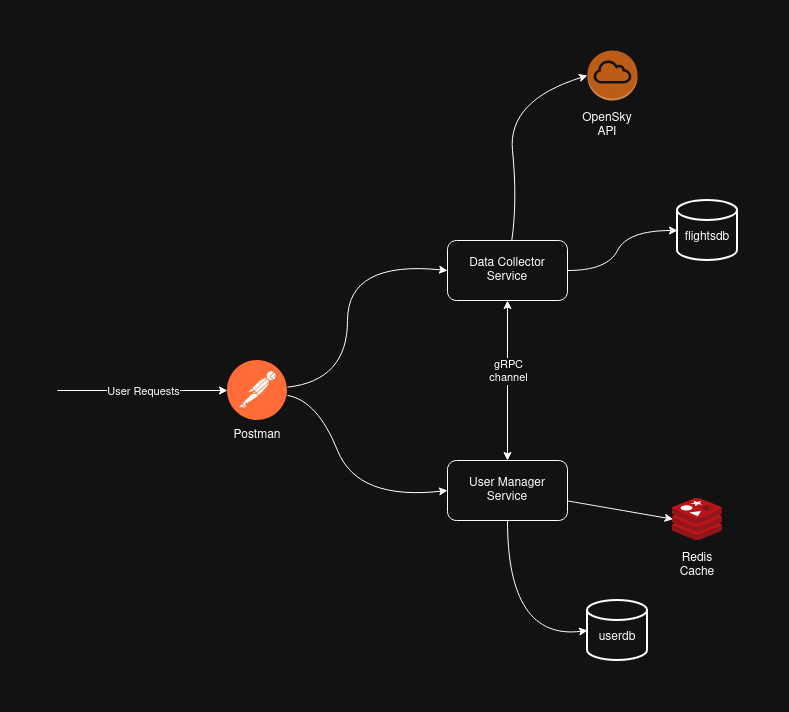

# SkyTracks

SkyTracks is a microservices-based platform for user management, airport interest tracking, and flight data collection. The system leverages Flask, PostgreSQL, Redis, gRPC, and Docker Compose for robust, scalable, and maintainable service orchestration.

## Project Overview

SkyTracks enables:
- User registration and management
- Association of users with airports of interest
- Periodic collection and analysis of flight data
- Communication between services via gRPC
- Data persistence in dedicated PostgreSQL databases

API documentation and example requests are provided via:
- [SkyTracks_APIs.postman_collection.json](docs/SkyTracks_APIs.postman_collection.json) (Postman collection)
- [swagger.yaml](docs/swagger.yaml) (OpenAPI/Swagger specification)

## Architecture



The system is composed of several Dockerized services:
- **user_manager**: Handles user registration, authentication, and airport interests (REST + gRPC).
- **data_collector**: Collects and analyzes flight data, interacts with user_manager via gRPC.
- **postgres_user**: PostgreSQL database for user and interest data.
- **postgres_flights**: PostgreSQL database for flight data.
- **redis**: Caching and idempotency.

Each service is isolated in its own container, communicating over dedicated Docker networks for security and modularity.

## Deployment Instructions

**Requirements**

- Docker & Docker Compose
- (Optional) Postman or Swagger UI for API testing

1. **Clone the repository:**
	```bash
	git clone https://github.com/fabfic/SkyTracks.git
	cd SkyTracks
	```


2. **Configure OpenSky Credentials in `docker-compose.yml`:**

	 Set your client credentials or use the ones already provided.

	 ```yaml
	 data_collector:
		 environment:
			 CLIENT_ID: "your-client-id"
			 CLIENT_SECRET: "your-client-secret"
	 ```

3. **Build and start the services:**
	```bash
	docker compose up -d --build
	```

4. **API Documentation:**
	- Import [SkyTracks_APIs.postman_collection.json](docs/SkyTracks_APIs.postman_collection.json) into Postman to test endpoints with sample data.
	- View [swagger.yaml](docs/swagger.yaml) in [Swagger UI](https://editor.swagger.io/) or compatible tools for detailed API documentation.

## Usage


### Register a User
Send a POST request to `http://localhost:5000/user` with a JSON body:
```json
{
	"email": "john.doe@example.com",
	"username": "johndoe",
	"password": "StrongP@ssword123"
}
```
**Response (201):**
```json
{
	"message": "User created successfully",
	"user_id": "123e4567-e89b-12d3-a456-426614174000"
}
```

### Delete a User

Send a DELETE request to `http://localhost:5000/user/{user_id}` (replace `{user_id}` with the actual user ID).

**Response (200):**
```json
{
	"message": "User deleted successfully"
}
```

### Add Airport Interest

Send a POST request to `http://localhost:6000/user-interests` with a JSON body:
```json
{
	"email": "john.doe@example.com",
	"airport_code": "EGLL"
}
```

**Response (201):**
```json
{
	"message": "New airport associated successfully"
}
```

### Remove Airport Interest

Send a DELETE request to `http://localhost:6000/user-interests?email=john.doe@example.com&airport_code=EGLL`

**Response (200):**
```json
{
	"message": "Airport removed from user's interests successfully"
}
```

### Get User Interests

Send a GET request to:
```
http://localhost:6000/user-interests?email=john.doe@example.com
```
**Response (200):**
```json
{
	"interests": ["EGLL", "LFPG", "EDDF"]
}
```

### Get Last Flights for an Airport
Send a GET request to:
```
http://localhost:6000/user-interests/lastflights/EGLL
```
**Response (200):**
```json
{
	"last_departure": {
		"callsign": "BA2490",
		"icao24": "abcd12",
		"departure_time": "2025-12-13T12:00:00Z",
		"arrival_time": "2025-12-13T14:00:00Z",
		"origin_airport": "EGLL",
		"destination_airport": "EDDF"
	},
	"last_arrival": {
		"callsign": "LH1234",
		"icao24": "efgh34",
		"departure_time": "2025-12-13T10:00:00Z",
		"arrival_time": "2025-12-13T12:00:00Z",
		"origin_airport": "EDDF",
		"destination_airport": "EGLL"
	}
}
```

### Get Airport Traffic Average
Send a GET request to:
```
http://localhost:6000/user-interests/traffic-average?email=john.doe@example.com&airport_code=EGLL&days=7
```
**Response (200):**
```json
{
	"average_departures": 15.3,
	"average_arrivals": 14.7
}
```

All endpoints, request/response formats, and additional example payloads are documented in the provided Postman and Swagger files. You can use the Postman collection to test these requests directly with sample data.